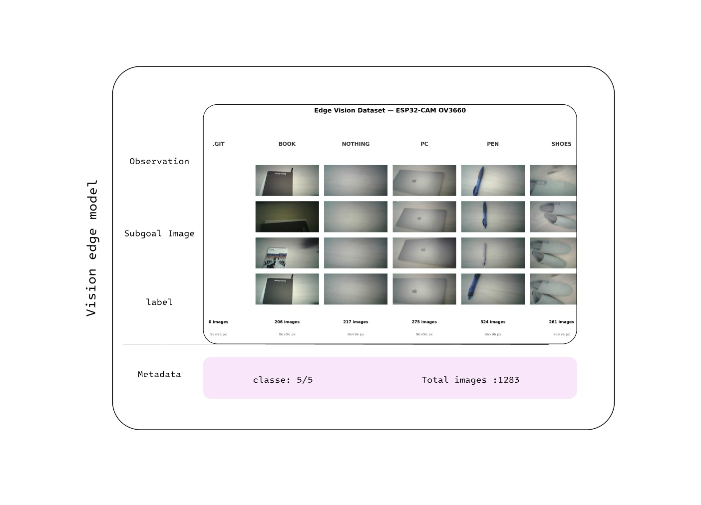

# edge-vision-model

version 0.5 - June 2026

Author:[Souleymane Diallo]

# Overview

edge-vision-model is an ongoing computer vision project focused on the development and deployment of a Convilutional Neural Network (CNN) on a resource-constrained microcontroller.

The objective is to designed an end-to-end embedded vision pipeline capable of performing image classification in real time while respecting memory, computation and power constraints imposed by embedded hardware.

The project covers the complete tiny machine learning workflow :

- Dataset acquisition and preparation using an OV2640 Cam and EESP-32 board CAM
- CNN architecture design
- Model training and validation
- Model optimization and quantization
- Deployment on microcontroller hardware (ESP32-S3)
- Real-time inference and performance evaluation

---

# Project Goals

The primary objectives are:

- Building our own image dataset
- Training a CNN model for image classification
- optimizig he model for embedded execution
- Deploy the model using TensorFlow Lite for Microcontrollers
- Evaluate accuracy, latency and memory usage on target hardware

---

# Current Status

| Task                 | Status        |
|----------------------|---------------|
| Problem Definition   | Completed     |
| Dataset Collection   | Completed     |
| Dataset Cleaning     | Completed     |
| Dataset Annotation   | Completed     |
| Data Augmentation    | In Progress   |
| CNN Training         | In Progress   |
| Model Optimization   | Planned       |
| Quantization         | Planned       |
| Embedded Deployment  | Planned       |
| Real-Time Testing    | Planned       |

# Dataset

The current dataset contains:

- 1260 images
- Multiple data aquisition process
- Validation substets

